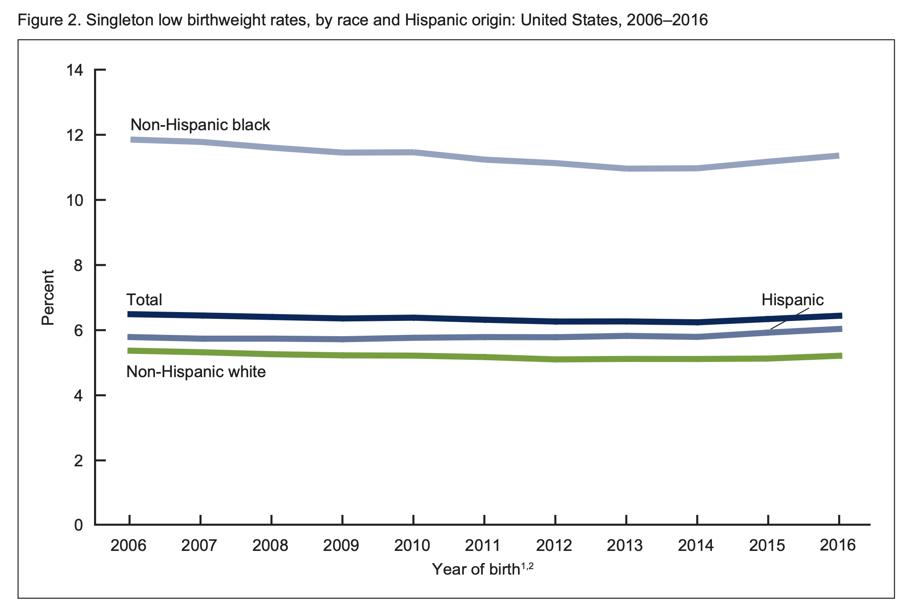
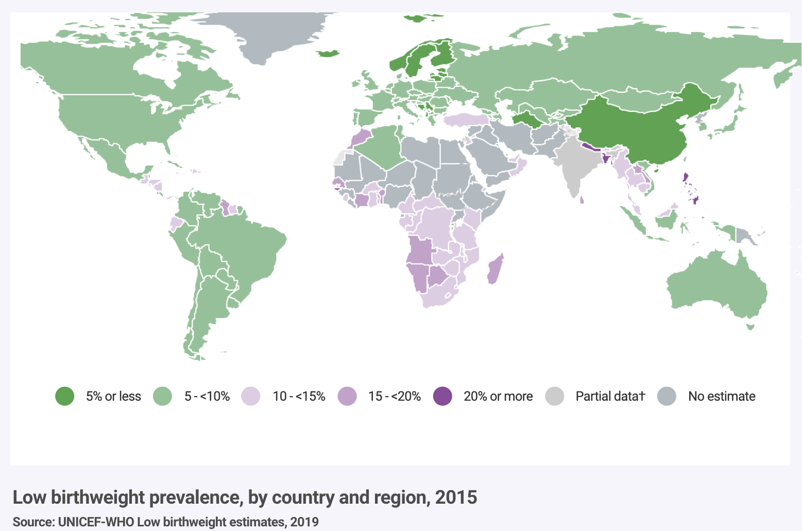

# Introduction to Probability and Random Variables

## Discrete Probability

We will now transition to probability and statistical inference. We start by covering some basic principles related to categorical data. This subset of probability is referred to as _discrete probability_. 

### Relative Frequency

The word probability is used in everyday language. For example, Google's auto-complete of "What are the chances of" gives us "getting pregnant", "getting struck by lightening", and "winning the lottery". Answering questions about probability is often hard if not impossible. Here we discuss a mathematical definition of _probability_ that does permit us to give precise answers to certain questions. 

For example, if I have 2 red beads and 3 blue beads inside an urn (or jar) and I pick one at random, what is the probability of picking a red one? Our intuition tells us that the answer is 2/5 or 40%. A precise definition can be given by noting that there are five possible outcomes of which two satisfy the condition necessary for the event "pick a red bead".  Because each of the five outcomes has the same chance of occurring we conclude that the probability is 0.4 for red and 0.6 for blue. 

A more tangible way to think about the probability of an event is as the proportion of times the event occurs when we repeat the experiment over and over, independently, and under the same conditions. 

 <center></center>

### Notation

We use the notation $\mbox{Pr}(A)$ to denote the probability of event $A$ happening. We use the very general term _event_ to refer to things that can happen when something happens by chance. For example, in our previous example the event was "picking a red bead". In a political poll in which we call 100 likely voters at random, an example of an event is "calling 48 Democrats and 52 Republicans".

In data science applications, we will often deal with continuous variables. In these cases events will often be things like "is this person taller than 6 feet". In this case we write events in a more mathematical form: $X \geq 6$. We will see more of these examples later. Here we focus on categorical data.


### Simulations

Computers provide a way to actually perform the simple random experiment described above: pick a bead at random from a bag with three blue beads and two red ones. Random number generators permit us to mimic the process of picking at random. 

An example is the `sample` function in R. We demonstrate its use in the code below.  First, we use the function `rep` (for replicate) to generate the urn:

```{r}
beads <- rep(c("red", "blue"), times = c(2,3))
beads
```

and then use `sample` to pick a bead at random:

```{r}
sample(beads, 1)
```

This line of code produces one random outcome. We want to repeat this experiment "over and over". However, it is of course impossible to repeat forever. Instead, we repeat the experiment a large enough number of times to make the results practically equivalent. This is an example of a simulation. 

Note that much of what mathematical and theoretical statisticians study, something we do not cover in this course, relates to providing rigorous definitions of "practically equivalent" as well as studying how close a large number of experiments gets us to what happens in the limit. Later in this lecture we provide a practical approach to deciding what is "large enough".

To perform our first simulation we use the `replicate` function, which permits us to repeat the same task any number of times. Here we repeat the random event $B =$ 10,000 times:

```{r}
B <- 10000
events <- replicate(B, sample(beads, 1))
```

We can now see if in fact, our definition is in agreement with this simulation approximation. We can use `table` to see the distribution:

```{r}
tab <- table(events)
tab
```

and `prop.table` gives us the proportions:

```{r}
prop.table(tab)
```

The numbers above are the estimated probabilities provided by this simulation. Statistical theory, not covered here, tells us the as $B$ gets larger, the estimates get closer to 3/5 = 0.6 for blue and 2/5 = 0.4 for red. 

This is a simple and not very useful example, but we will use simulation to estimate probabilities in cases in which it is harder to compute the exact ones. Before we go into more complex examples we use simple ones to demonstrate the computing tools available in R.

### With and without replacement

The function `sample` has an argument that permits us to pick more than one element from the urn. However, by default, this selection occurs **_without replacement_: after a bead is selected, it is not put back in the bag**. Note what happens when we ask to randomly select five beads:

```{r}
sample(beads, 5)
sample(beads, 5)
sample(beads, 5)
```

This results in rearrangements that always have three blue and two red beads. If we ask that six beads be selected, we get an error

```{r, eval=FALSE}
sample(beads, 6)
```

`Error in sample.int(length(x), size, replace, prob) : 
  cannot take a sample larger than the population when 'replace = FALSE'`

However, the `sample` function can be used directly, without the use of `replicate`, to repeat the same experiment of picking one out of the 5 beads, over and over, under the same conditions. To do this we sample _with replacement_: return the bead back to the urn after selecting it. 

We can tell `sample` to do this by changing the `replace` argument, which defaults as `FALSE`, to `replace = TRUE`:

```{r}
events <- sample(beads, B, replace = TRUE)
prop.table(table(events))
```

Note that, not surprisingly, we get results very similar to 
those previously obtained with `replicate`.
  
### Probability Distributions

Defining a distribution for categorical outcomes is relatively straightforward. We simply assign a probability to each category.
In cases that can be thought of as beads in an urn, for each bead type their proportion defines the distribution. 

If we are randomly calling likely voters from a population that is 44% Democrat, 44% republican, 10% undecided and 2% green party, these proportions define the  probability for each group. The probability distribution is:

$$
\mbox{Pr}(\mbox{picking a Republican})=0.44\\ \mbox{Pr}(\mbox{picking a Democrat})=0.44\\
\mbox{Pr}(\mbox{picking an undecided})=0.10\\
\mbox{Pr}(\mbox{picking a Green})=0.02\\
$$

### Independence

We say two events are independent if the outcome of one does not affect the other. The classic example are coin tosses. Every time we toss a fair coin the probability of seeing heads is 1/2 regardless of what previous tosses have revealed. The same is true when we pick beads from an urn with replacement. In the example above the probability of red is 0.40 regardless of previous draws. 

When the first outcome affects the next, events are considered **not independent**. To see an extreme case of non-independent events, consider our example of drawing five beads at random **without** replacement:

```{r, echo=FALSE}
# Set the seed so that we get the same outcomes each time
# we run the code even though it is random. We are setting 
# the random number generator. This is great for reproducibility.
set.seed(1)
x <- sample(beads, 5)
```

If you have to guess the color of the first bead you predict blue since blue has a 60% chance. But if I show you the result of the last four outcomes:

```{r}
x[2:5]
```

would you still guess blue? Of course not. Now you know that the probability of red is 1 since only a red bead remains. The events are not independent so the probabilities change.

### Conditional Probabilities

When events are not independent, _conditional probabilities_ are useful. We use the $\mid$ as shorthand for "given that" or "conditional on". So, for example, the probability of event $A$ occurring conditional on event $B$ occurring is:

$$
\mbox{Pr}(A \mid B)
$$


When $A$ and $B$ are independent, we have

$$
\mbox{Pr}(A \mid B) = \mbox{Pr}(A) 
$$

This is the mathematical way of saying: the fact that $B$ happened does not affect the probability of $A$ happening.
In fact, this can be considered the mathematical definition of independence.

## Random Variables

Random variables are numeric outcomes resulting from random processes. We can easily generate random variables using some of the simple examples we have shown. For example, define `X` to be 1 if a bead is blue and 0 otherwise (if it's red).

```{r}
set.seed(1)
beads <- rep( c("red", "blue"), times = c(2, 3))
X <- ifelse(sample(beads, 1) == "blue", 1, 0)
```

Here `X` is a random variable: every time we select a new bead the outcome changes randomly:

```{r}
ifelse(sample(beads, 1) == "blue", 1, 0)
ifelse(sample(beads, 1) == "blue", 1, 0)
ifelse(sample(beads, 1) == "blue", 1, 0)
```

Sometimes it's 1, sometimes it's 0.

In data science we often deal with data that is affected by chance in some way: the data comes from a random sample, the data is affected by measurement error or the data measures some outcome that is random in nature. **Being able to quantify the uncertainty introduced by randomness is one of the most important jobs of a data scientist**. Statistical inference offers a framework for doing this as well as several practical tools. 


## Central Limit Theorem

**The Central Limit Theorem (CLT) tells us that when the number of draws, also called the _sample size_, is large the probability distribution of the sum of the independent draws is approximately normal**. Because sampling models are used for so many data generation processes, the CLT is considered one of the most important mathematical insights in history. 


## The Expected Value and Standard Error

In statistics books, it is common to use the letter $\mbox{E}$ like this 

$$\mbox{E}[X]$$ 

to denote the expected value (also known as the mean or average) of the random variable $X$. The _standard error_  (SE) gives us an idea of the size of the variation around the expected value. In statistics books it is common to use 

$$\mbox{SE}[X]$$ 

to denote the standard error of a random variable. The standard error tells us the typical difference between a random variable and its expectation. 


# Regression

## Motivating example: Prenatal Care

Infant birth weight is the single most important factor affecting neonatal mortality. Children with lower birthweights are at increased risk of many medical problems later in life. Lower birthweights are associated with decreased disease resistance and increases in diseases such as asthma, rental failure, hypertension, diabetes, kidney development, hearing impairment, delays in motor and social development, and coronary disease.  Numerous studies have been conducted on risk factors for low birthweight in different populations. Many studies identify sociodemographic factors associated with the risk of low birthweight. Most likely a combination of biological, behavioral, environmental, and medical factors contribute to a baby’s birthweight.

The prevalence of low birthweight infants has been declining slowly in the United States over the last 4 decades, but is still a problem that persists here and globally. 

<center></center>

<center></center>

### First Steps
In 1989, Seattle and King County in Washington state began a program using state and federal funds to expand Medicaid for low-income women. The new program, called [First Steps](https://www.kingcounty.gov/depts/health/locations/health-insurance/coverage/eligibility/first-steps-insurance.aspx) provides free prenatal care to low-income women. Prenatal care includes both medical attention and advice about lifestyle decisions that may affect birthweight. The goal of First Steps is to improve birth outcomes, including increased birthweights in King County. Low birthweight is defined as a birthweight of < 2,500 grams. Very low birthweight is defined as a birthweight of < 1,500 grams.

You have been hired as a consultant by the board of public health in King County, and they have provided you with a random sample of all singleton births in King County in 2001. Your job is to investigate the question of whether participation in 'First Steps' increases birthweights.  

The data includes the following information for 2,500 infants and mothers:

* `gender`: the child’s sex
* `plural`: the multiplicity of the birth
* `age`: the mother’s age at birth
* `race`: the mother’s race
* `parity`: prior number of children in family
* `married`: was the mother married?
* `bwt`: birthweight (grams)
* `smokeN`: number of cigarettes per day during pregnancy
* `drinkN`: number of drinks per day during pregnancy
* `firstep`: indicates participation in First Steps
* `welfare`: indicates that mother was on welfare
* `smoker`: indicates maternal smoking during pregnancy
* `drinker`: indicates maternal alcohol use during pregnancy
* `wpre`: mother’s pre-pregnancy weight in pounds
* `wgain`: amount of maternal weight-gain during pregnancy
* `education`: years of mother’s education
* `gestation`: gestational age at birth (in weeks)

```{r, message=FALSE, warning=FALSE, echo=FALSE}
library(ggplot2)
library(dplyr)
```

```{r, message=FALSE, warning=FALSE, echo=FALSE}
data <- read.table("KingCounty2001_data.txt", header = TRUE)
head(data)
```

Of the 2,500 women who gave birth, 403 of them joined the First Steps program and 2,097 did not. 

```{r}
table(data$firstep)
```

Studies have shown that race, mother's smoking and drinking status, mother's age and gestation are all associated with birthweight. Let's explore our dataset a bit to see if these variables are also associated with birthweight in our sample.

```{r, message=FALSE, warning=FALSE}
p <- data %>% ggplot(aes(age, bwt)) +
              geom_point(alpha = 0.3) +
              ylab("Birth weight (grams)") +
              xlab("Mother's age")
p
```

There doesn't seem to be a clear association between mother's age and birthweight.


```{r, message=FALSE, warning=FALSE}
p <- data %>% ggplot(aes(gestation, bwt)) +
              geom_point(alpha = 0.3) +
              ylab("Birth weight (grams)") +
              xlab("Gestation (weeks)")
p
```

There is a very clear association between gestational age and birthweight: longer gestation is associated with larger birthweight. This makes sense since an infant continues to develop and grow during gestation.

```{r, message=FALSE, warning=FALSE}
p <- data %>% ggplot(aes(wpre, bwt)) +
              geom_point(alpha = 0.3) +
              ylab("Birth weight (grams)") +
              xlab("Mother's weight before pregnancy")
p
```

There seems to be a slightly positive association between a mother's weight before pregnancy and birthweight. It is difficult to be sure just from the scatter plot.

```{r, message=FALSE, warning=FALSE}
p <- data %>% ggplot(aes(wgain, bwt)) +
              geom_point(alpha = 0.3) +
              ylab("Birth weight (grams)") +
              xlab("Mother's weight gain during pregnancy")
p
```

Mother's total weight gain seems to be positively associated with birthweight, but again, this is difficult to tell just from a scatterplot. There also seem to be a few outliers in terms of weight gained. 


We can also look at the distribution of birthweight stratified by participation in the First Steps program. 

```{r, message=FALSE, warning=FALSE}
p <- data %>% ggplot(aes(as.factor(firstep), bwt, fill = as.factor(firstep))) +
              geom_boxplot() +
              ylab("Birth weight (grams)") +
              xlab("Participation in First Steps program") +
              theme(legend.position = "none") 
p
```


```{r, message=FALSE, warning=FALSE}
p <- data %>% ggplot(aes(bwt)) +
              geom_histogram(color="black") +
              xlab("Birth weight (grams)") +
              facet_grid(as.factor(firstep)~.) +
              geom_vline(data=filter(data, firstep==0), aes(xintercept = 2500), linetype = "dashed", color = "red") +
              geom_vline(data=filter(data, firstep==1), aes(xintercept = 2500), linetype = "dashed", color = "red")
p
```

From the plots above it's impossible to tell if the First Steps program increases birthweights. Linear regression will help us parse all this out and quantify the associations between birthweight and the variables in the dataset.


